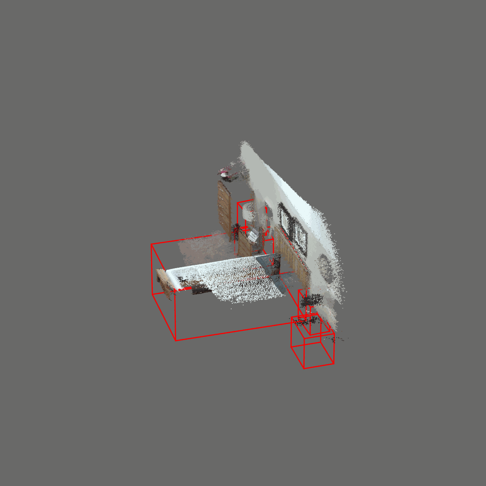
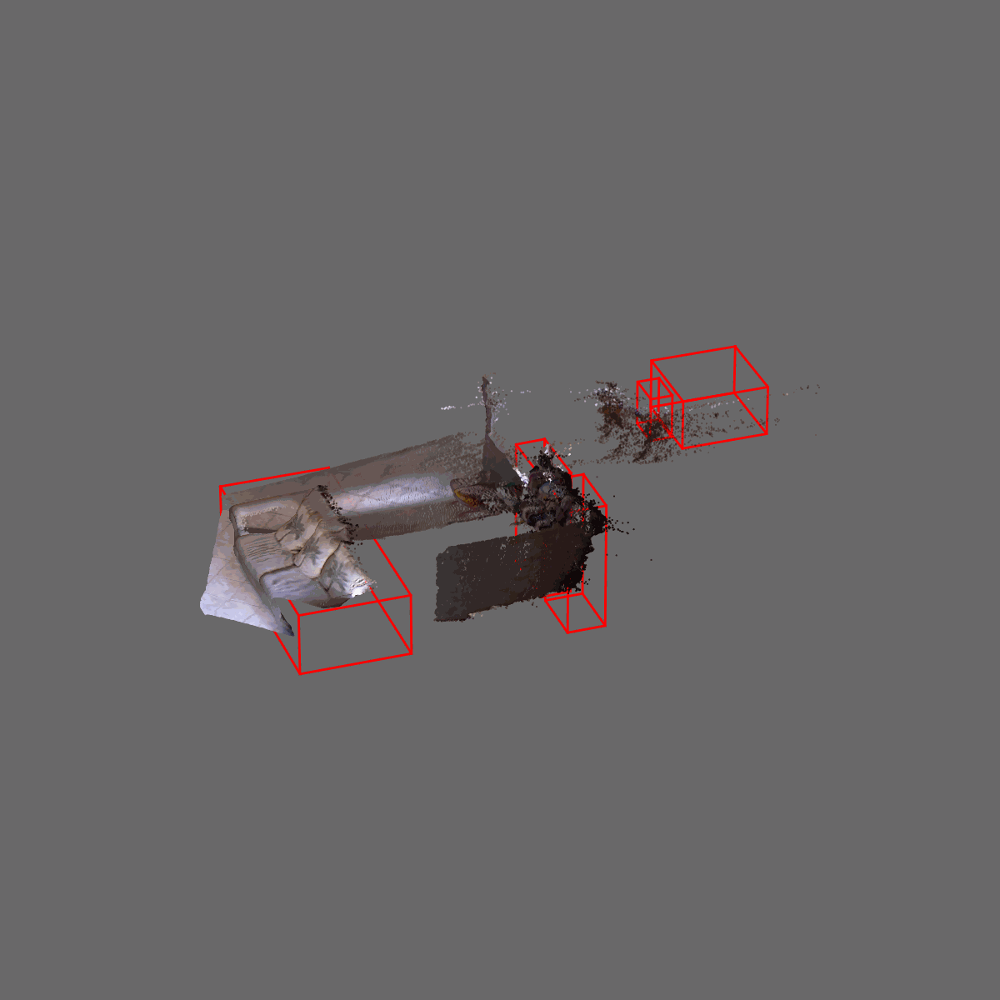
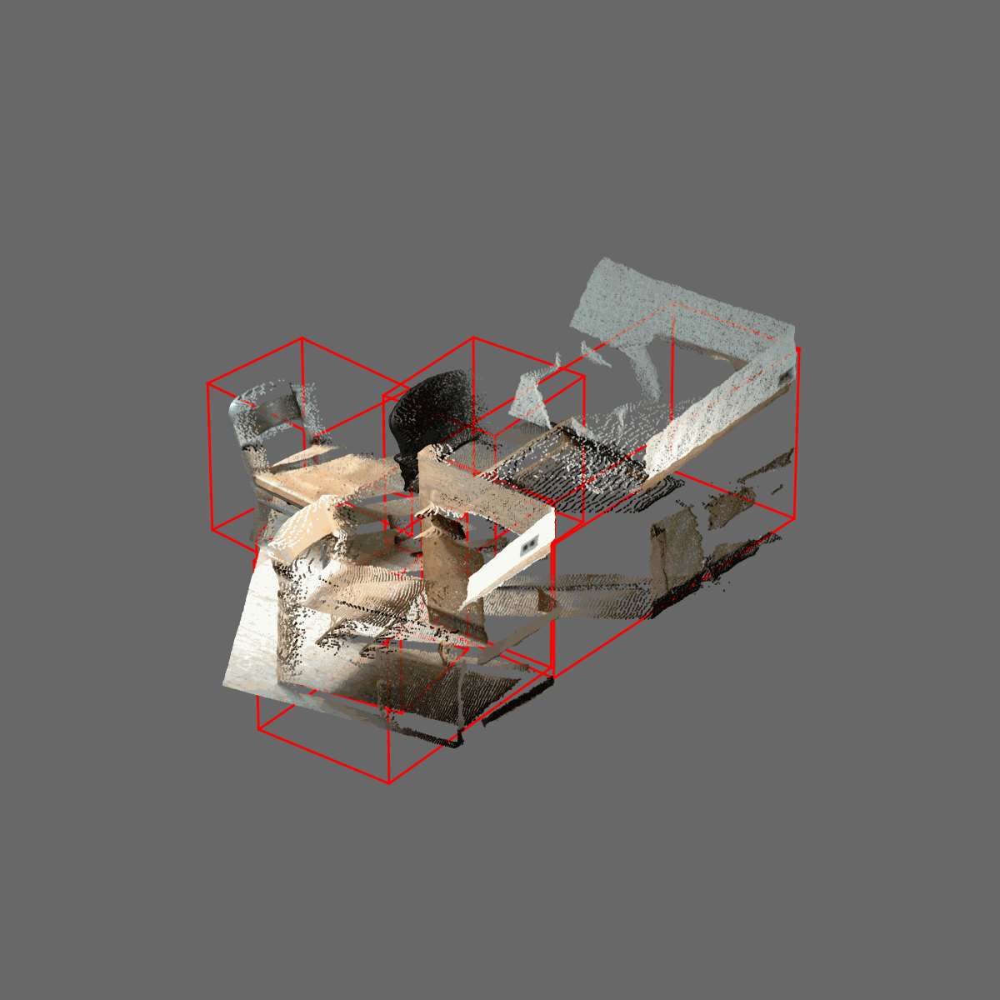
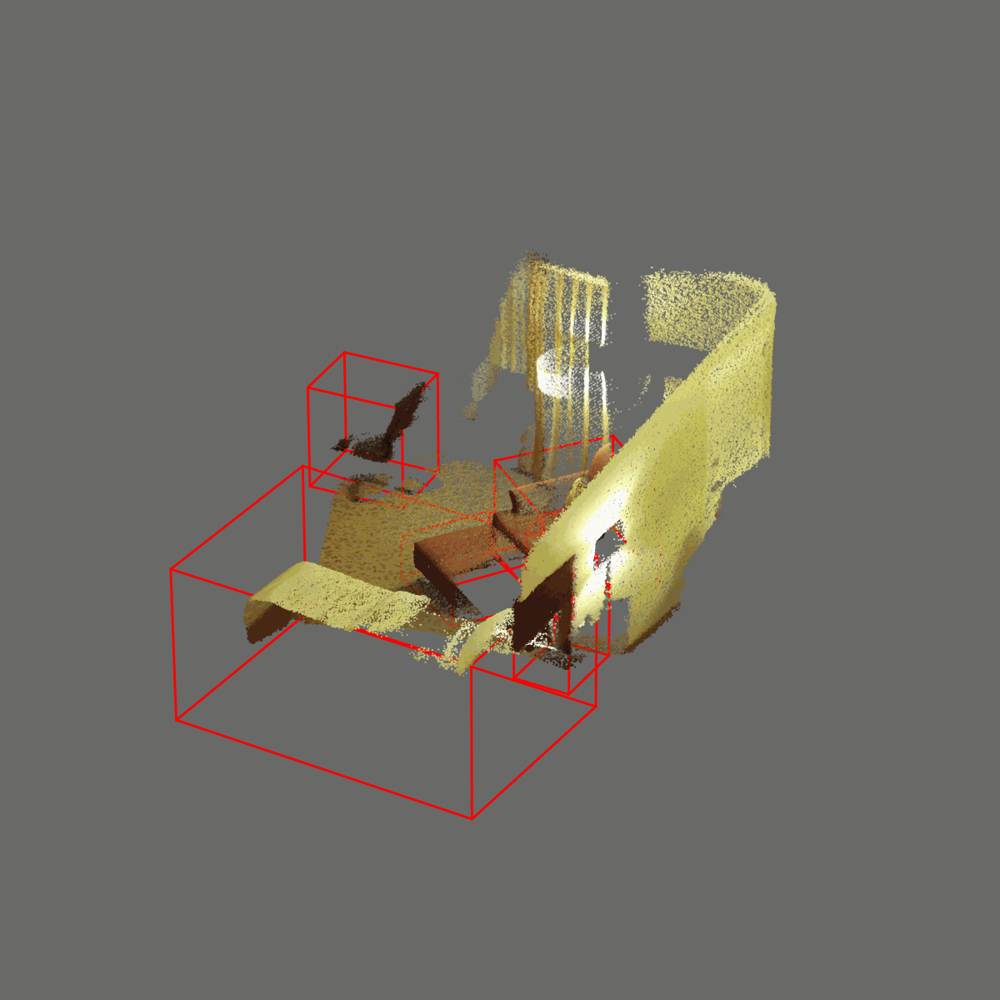
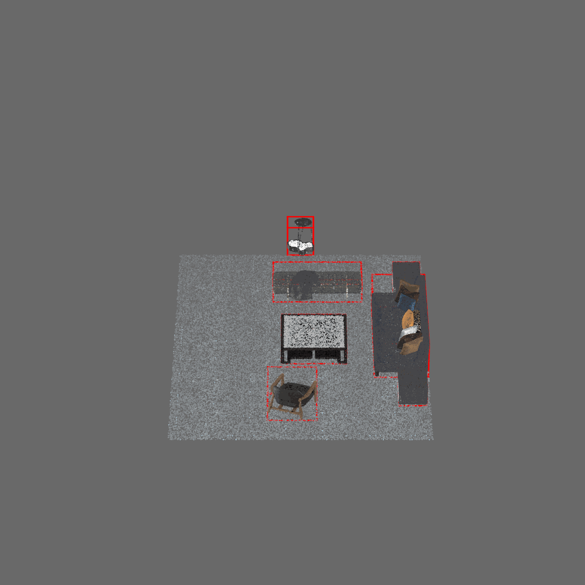
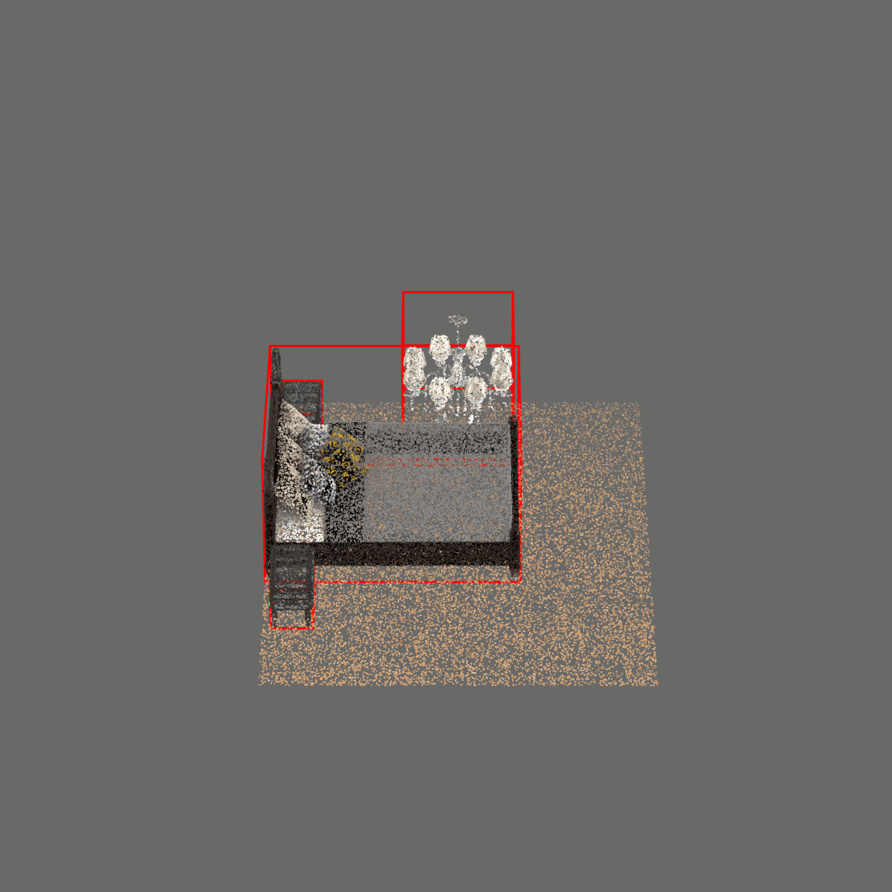
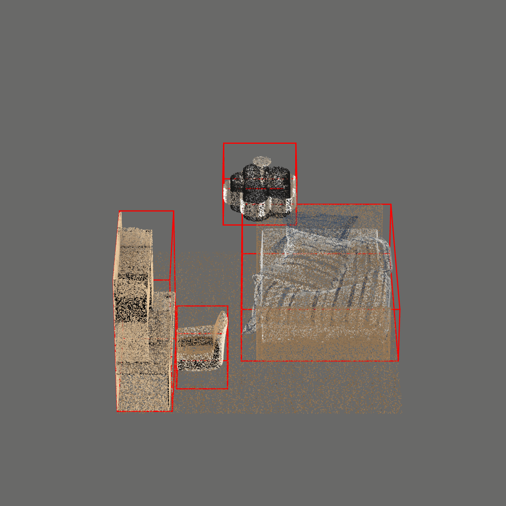
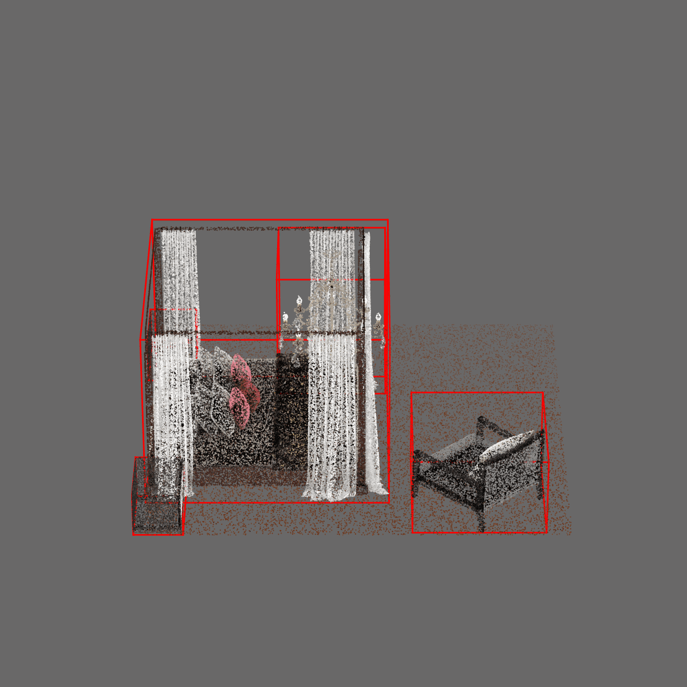

# Indoor 3D object detection datasets

We provide unified format of existing indoor 3D object detection datasets **ScanNet**, **SUN RGB-D**, **3D Front**
as well as our newly proposed large-scale datasets **ProcTHOR-OD** and **ProcFront**.
Different datasets exhibit different distribution of style, point cloud quality, layout and instance features.

## Our proposed datasets

We open source the generation code of our proposed ProcTHOR-OD and ProcFront dataset at:
[ProcTHOR-OD](https://github.com/JeremyZhao1998/ProcTHOR-OD)
which provides the code of generating the ProcTHOR-OD layouts and the method to export 3D mesh files.
With our provided code, users can generate unlimited number of room layouts and export 3D mesh files.

**ProcTHOR-OD**

Our proposed ProcTHOR-OD dataset is a large-scale synthetic dataset for object detection in 3D.
It uses ProcTHOR generation pipeline to automatically generate 3D single room layouts, 
with accurate annotations of objects and their poses for object detection task.

<table>
  <tr>
    <td></td>
    <td></td>
    <td></td>
    <td></td>
  </tr>
</table>

**ProcFront**

ProcFront shares the same room layouts with ProcTHOR, but integrates instances from 3D Front dataset
to isolate the domain gap of layout and instance for domain adaptation investigations.

<table>
  <tr>
    <td></td>
    <td></td>
    <td></td>
    <td></td>
  </tr>
</table>

The convertion code of ProcTHOR-OD and ProcFront datasets is provided at: [procthor](./procthor/README.md).

## Existing datasets

**ScanNet**

ScanNet dataset is a high quality real-world dataset collected from 3D scanners.

The convertion code of ScanNet dataset is provided at: [scannet](./scannet/README.md)

<table>
  <tr>
    <td></td>
    <td></td>
    <td></td>
    <td></td>
  </tr>
</table>

**SUN RGB-D**

SUN RGB-D dataset is a large-scale dataset collected from real-world single RGB-D images, 
thus exhibiting low quality point clouds with obvious point omissions.

The convertion code of SUN RGB-D dataset is provided at: [sunrgbd](./sunrgbd/README.md)

<table>
  <tr>
    <td></td>
    <td></td>
    <td></td>
    <td></td>
  </tr>
</table>

**3D Front**

3D Front dataset is a synthetic dataset constructed by placing synthetic 3D models into rooms by
human expert designers.
It contains uniformly sampled high-quality 3D point clouds, but still lacks extensibility and realism.

The convertion code of 3D Front dataset is provided at: [3dfront](./3dfront/README.md)

<table>
  <tr>
    <td></td>
    <td></td>
    <td></td>
    <td></td>
  </tr>
</table>

## Converted data format

The converted data will be placed in the following folders:

```
<dataset_root>
    └─ 3dfront
        └─ pc_bboxes_axis_aligned_train
            └─ <scene_id>_pc_bboxes.npz
            └─ info
                └─ mean_color.npz
                └─ mean_sizes.npz
                └─ obj_cnt.npz
        └─ pc_bboxes_axis_aligned_val
            └─ <scene_id>_pc_bboxes.npz
        └─ pc_bboxes_train
            └─ <scene_id>_pc_bboxes.npz
            └─ info
                └─ mean_color.npz
                └─ mean_sizes.npz
                └─ obj_cnt.npz
        └─ pc_bboxes_val
            └─ <scene_id>_pc_bboxes.npz
    └─ procfront
        └─ pc_bboxes_axis_aligned_train
        └─ pc_bboxes_axis_aligned_val
    └─ procthor
        └─ pc_bboxes_axis_aligned_train
        └─ pc_bboxes_axis_aligned_val
    └─ scannet
        └─ pc_bboxes_axis_aligned_train
        └─ pc_bboxes_axis_aligned_val
    └─ sunrgbd
        └─ pc_bboxes_axis_aligned_train
        └─ pc_bboxes_axis_aligned_val
        └─ pc_bboxes_train
        └─ pc_bboxes_val
```

In each ``pc_bboxes_<axis_aligned>_<train/val>`` folder, there is a ``<scene_id>_pc_bboxes.npz`` file containing
the following keys:

- ``pc``: ``N x 6`` point cloud coordinates and colors, where ``N`` is the number of points. The XYZ coordinates is right-handed with Z pointing up. The color is in RGB order normed to [0,1].
- ``bboxes``: ``M x 7`` bounding boxes, where ``M`` is the number of objects. The first 3 elements are the XYZ center, followed by 3 elements of XYZ sizes. The last element is the heading angle.
- ``categories``: ``M`` object categories in string format.

In the training set of each dataset, there is an ``info`` folder containing:

- ``mean_color.npz``: mean value of RGB color across all scenes in the training set.
- ``mean_sizes.npz``: mean value of XYZ sizes of each category in the training set, in the format of ``{<category>: [x, y, z]}``.
- ``obj_cnt.npz``: number of objects of each category in the training set, in the format of ``{<category>: <obj_cnt>}``.

You can construct your own dataset in the above format, and use it directly for training and evaluation in our codebase
by simply specifying the dataset name ``--src_dataset <dataset_name>`` in the training and evaluation configs.
