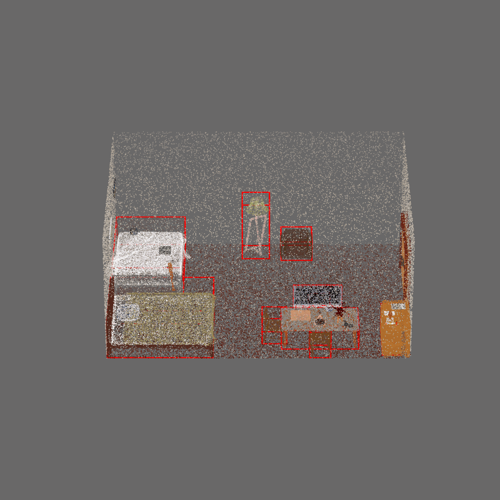
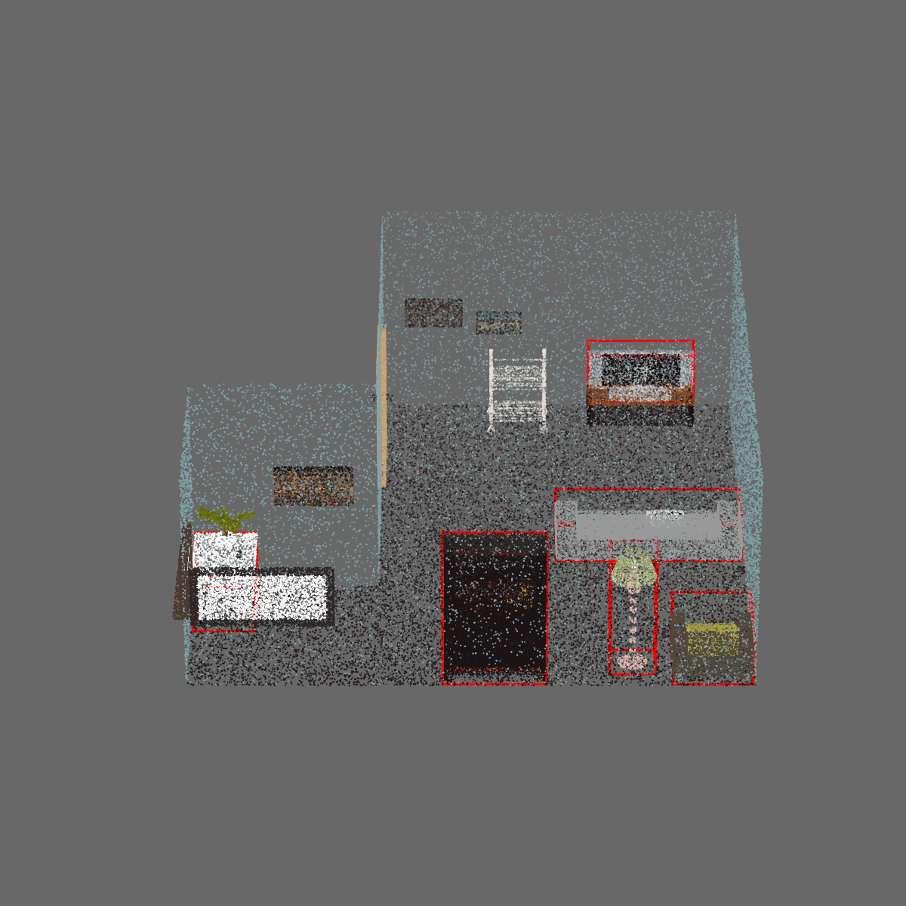
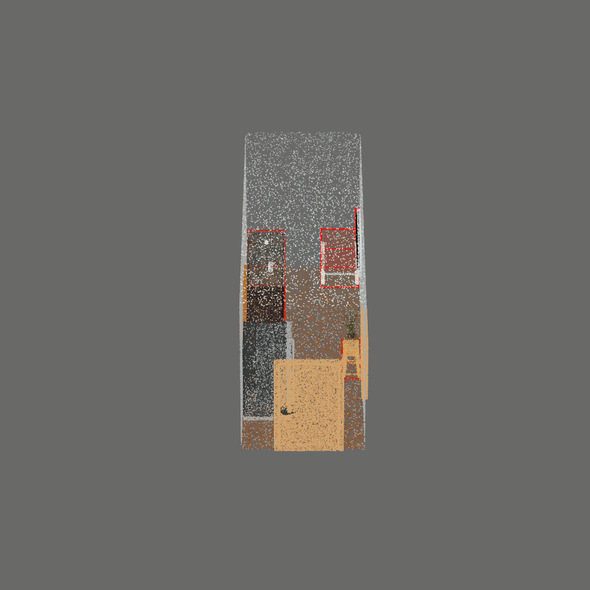
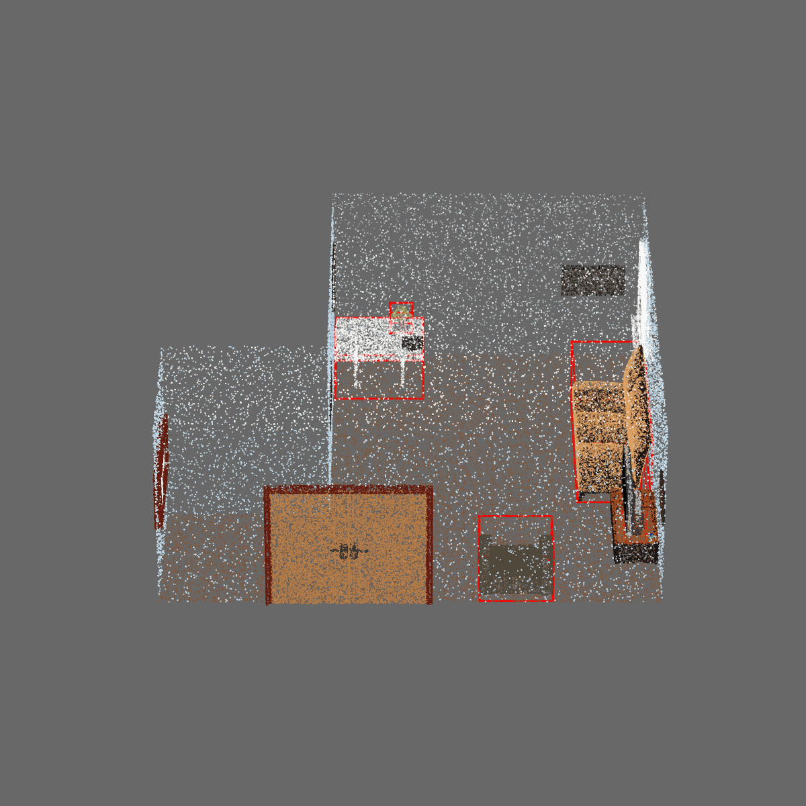
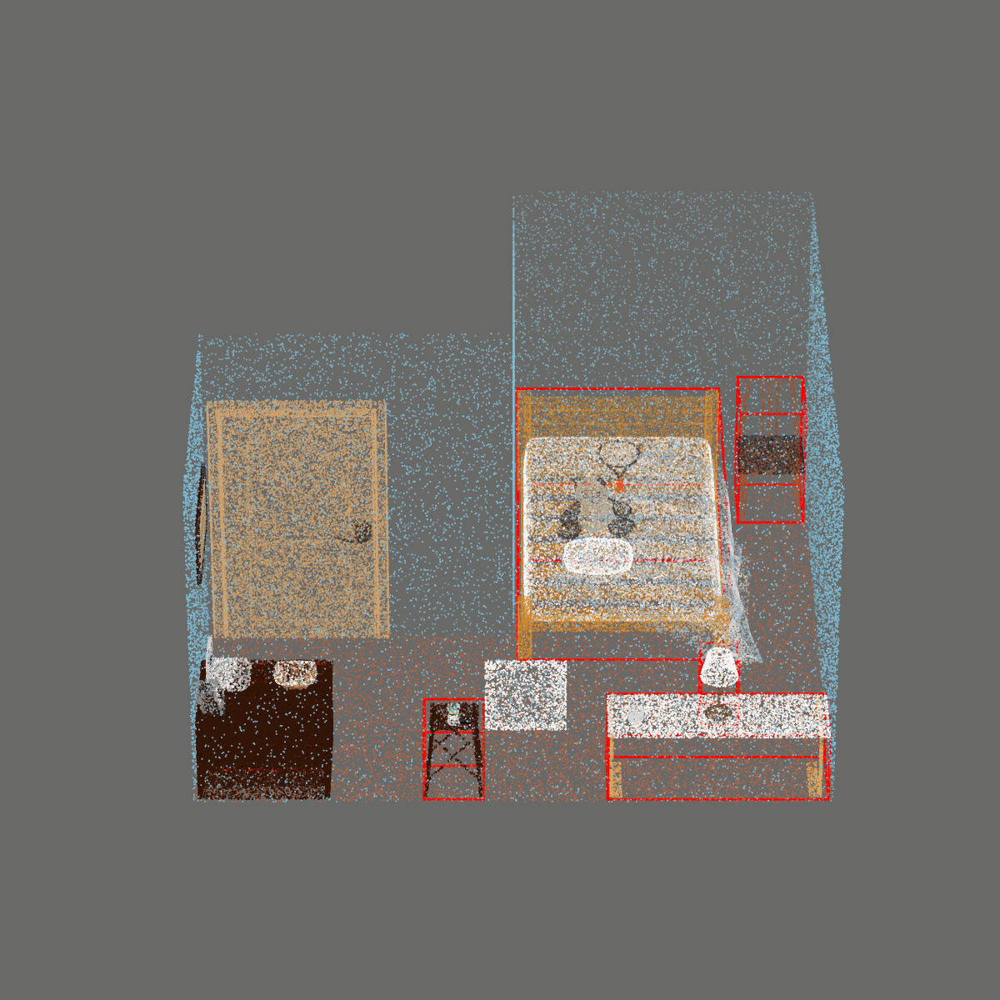
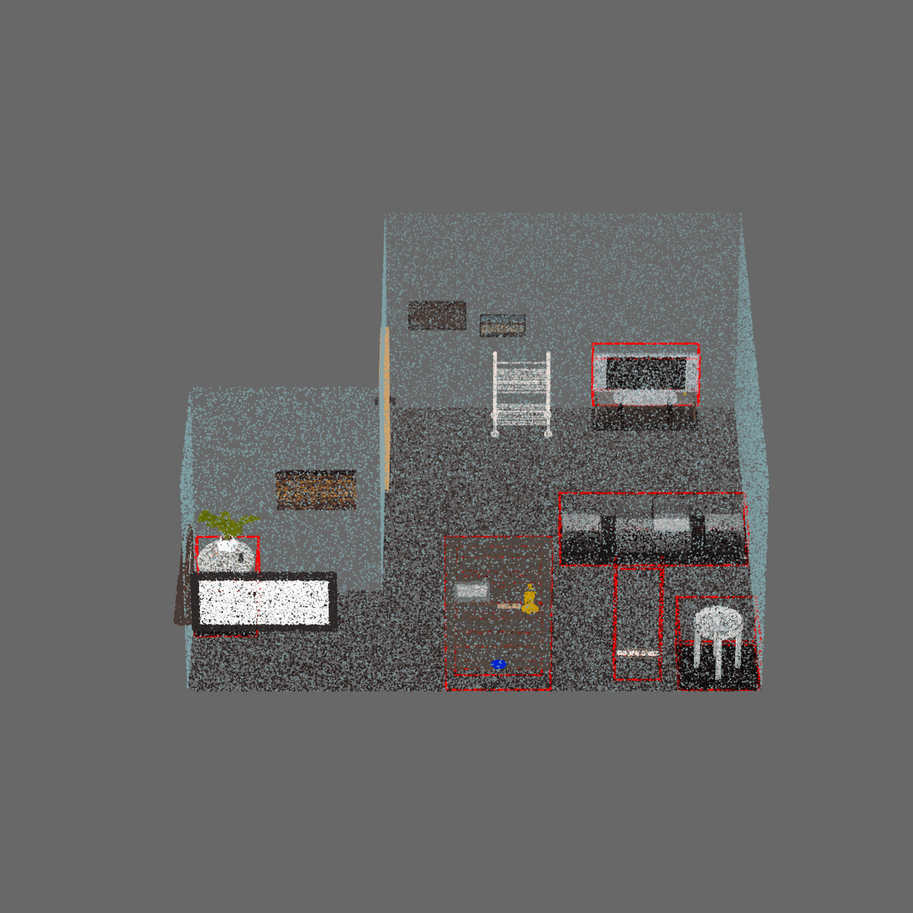
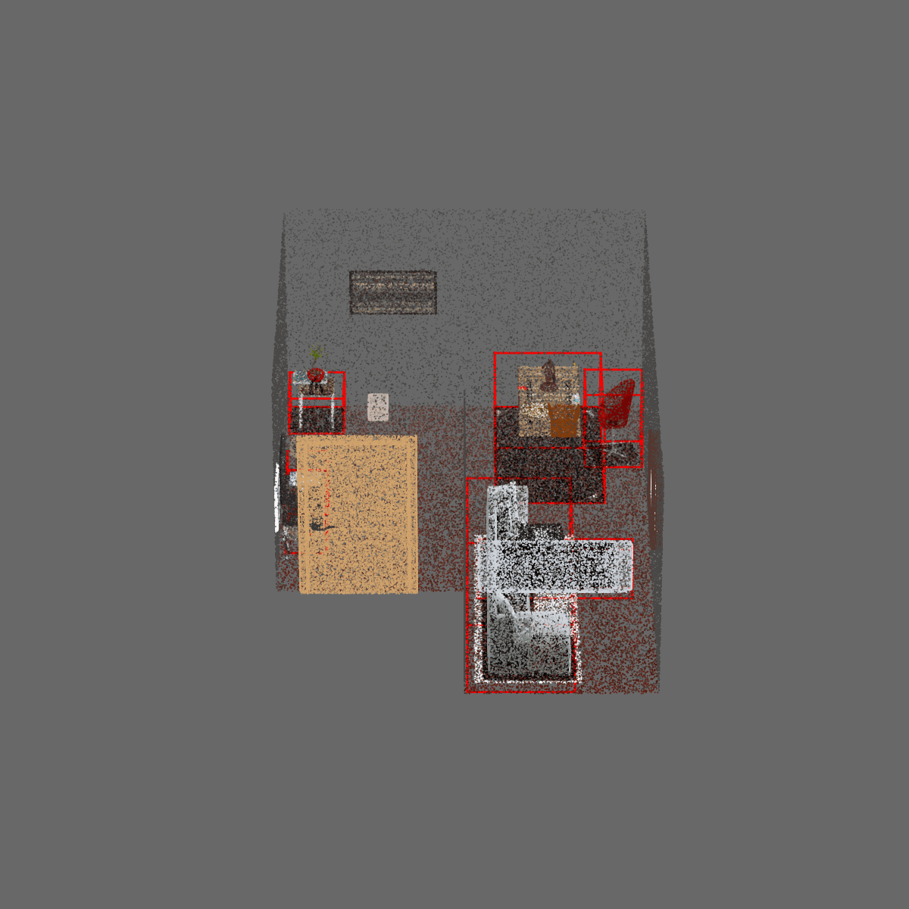
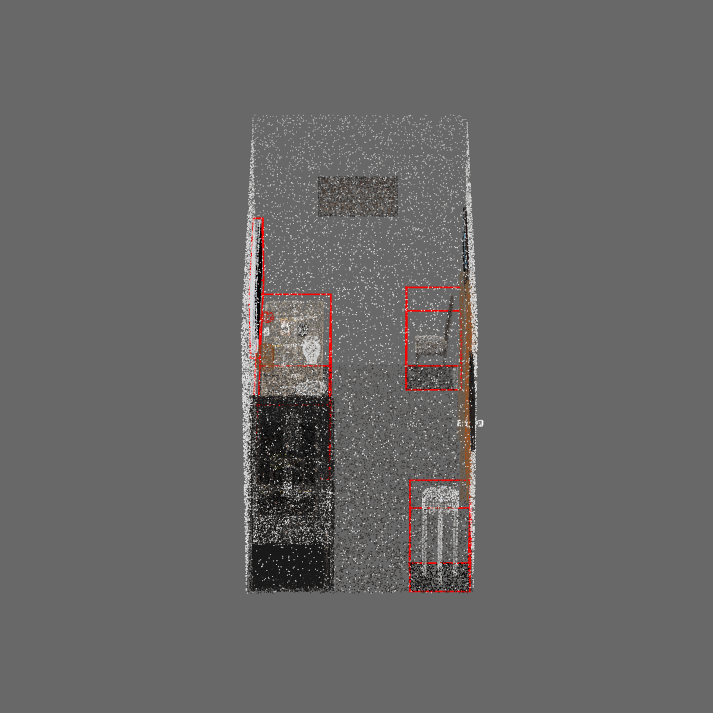

# Converting ProcTHOR-OD and ProcFront datasets

**ProcTHOR-OD**

Our proposed ProcTHOR-OD dataset is a large-scale synthetic dataset for object detection in 3D.
It uses ProcTHOR generation pipeline to automatically generate 3D single room layouts, 
with accurate annotations of objects and their poses for object detection task.

<table>
  <tr>
    <td></td>
    <td></td>
    <td></td>
    <td></td>
  </tr>
</table>

**ProcFront**

ProcFront shares the same room layouts with ProcTHOR, but integrates instances from 3D Front dataset
to isolate the domain gap of layout and instance for domain adaptation investigations.

<table>
  <tr>
    <td></td>
    <td></td>
    <td></td>
    <td></td>
  </tr>
</table>

## Raw data preparation

Please follow the instructions in [ProcTHOR-OD](https://github.com/JeremyZhao1998/ProcTHOR-OD) to
either download our provided ProcTHOR-OD and ProcFront dataset or generate datasets of any scale by yourself.

Place the mesh files and annotations in the following folders:

```
<dataset_root>
    └─ procthor
        └─ train_mesh
            └─ Room_00000.tar.xz
            └─ Room_00001.tar.xz
            └─ ...
        └─ train_anno
            └─ Room_00000.json.gz
            └─ Room_00001.json.gz
            └─ ...
        └─ val_mesh
            └─ Room_00000.tar.xz
            └─ Room_00001.tar.xz
            └─ ...
        └─ val_anno
            └─ Room_00000.json.gz
            └─ Room_00001.json.gz
            └─ ...
    └─ procfront
        └─ train_mesh
            └─ Room_00000.tar.xz
            └─ Room_00001.tar.xz
            └─ ...
        └─ val_mesh
            └─ Room_00000.tar.xz
            └─ Room_00001.tar.xz
            └─ ...
```

### Converting ProcTHOR-OD

```bash
cd pc_datasets/procthor
python convert_data.py --data_root <dataset_root>/procthor --output_root <dataset_root>/procthor
```

The generated data will be stored in ``<dataset_root>/procthor/pc_bboxes_axis_aligned_train`` and 
``<dataset_root>/procthor/pc_bboxes_axis_aligned_val``.

### Converting ProcFront

```bash
cd pc_datasets/procthor
python convert_data.py --data_root <dataset_root>/procthor --front_data_path <dataset_root>/procfront --output_root <dataset_root>/procfront
```

Note that since the ProcFront dataset follows the same room layout with ProcTHOR-OD,
the raw mesh files and annotations used are from ProcTHOR-OD, so the ``--data_root`` should be set to ``<dataset_root>/procthor``.
The mesh files under ``<dataset_root>/procfront/train_mesh`` and ``<dataset_root>/procfront/val_mesh`` only contains
instances from 3DFront dataset which are not included in ProcTHOR-OD.

The generated data will be stored in ``<dataset_root>/procfront/pc_bboxes_axis_aligned_train`` and 
``<dataset_root>/procfront/pc_bboxes_axis_aligned_val``.