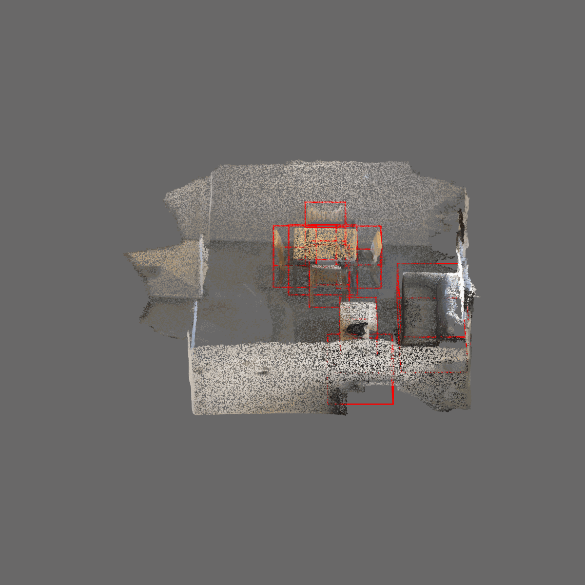
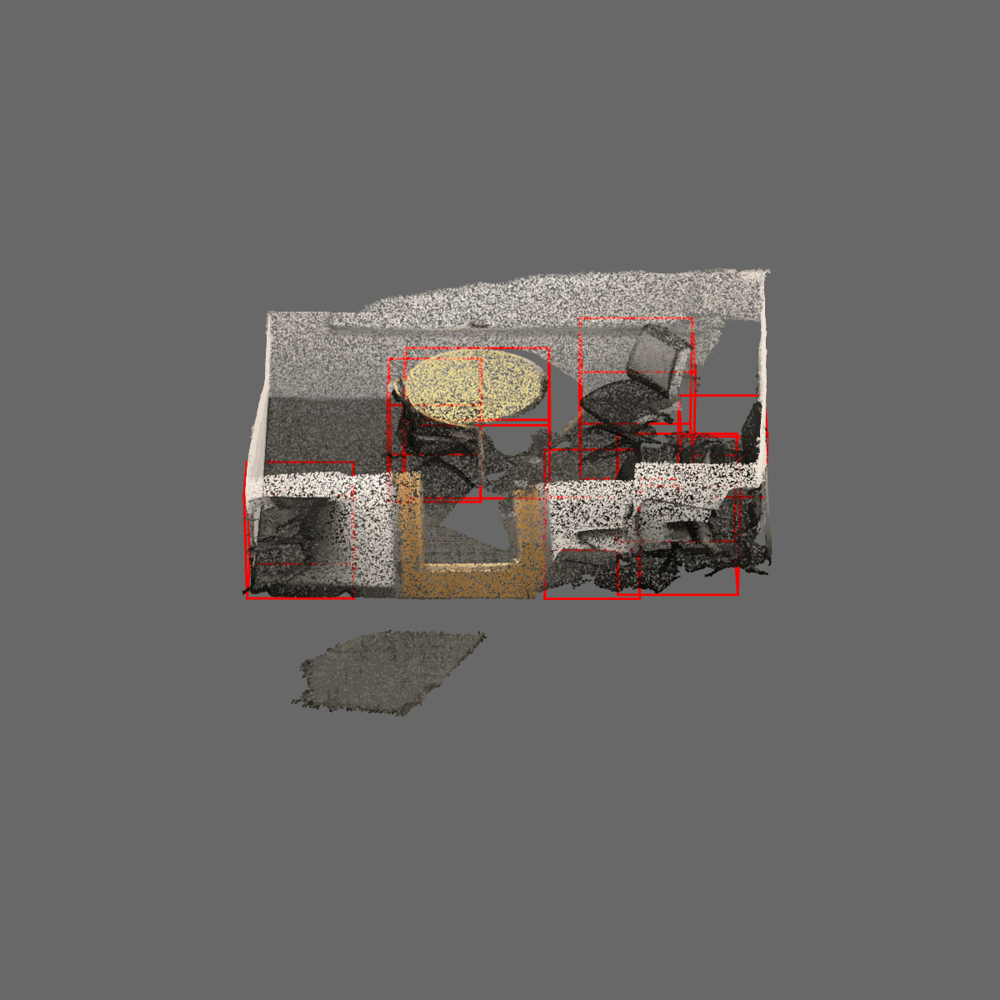
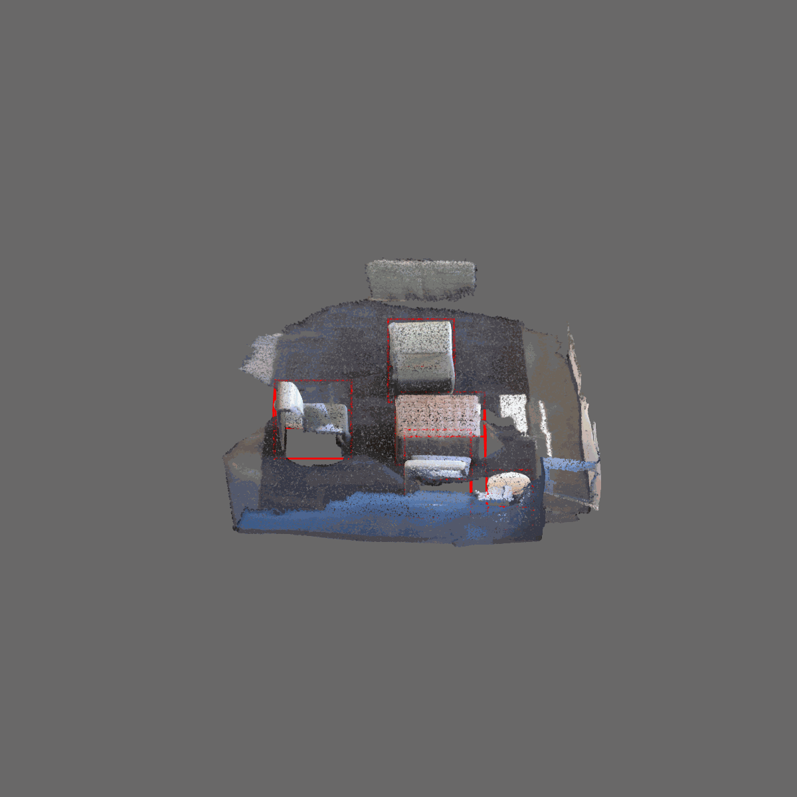
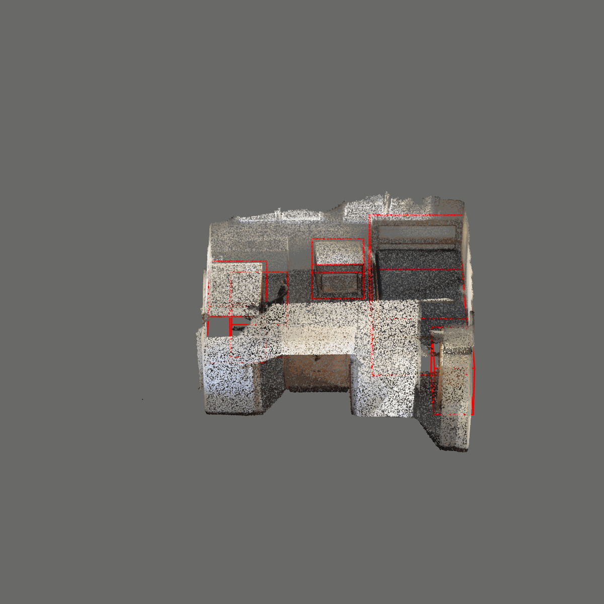

# Converting ScanNet dataset

**ScanNet**

ScanNet dataset is a high quality real-world dataset collected from 3D scanners.

<table>
  <tr>
    <td></td>
    <td></td>
    <td></td>
    <td></td>
  </tr>
</table>

## Raw data preparation

Follow the instructions in the [ScanNet website](https://github.com/ScanNet/ScanNet) to download the raw data.

Place the raw data files and annotations in the following folders:

```
<dataset_root>
    └─ scannet
        └─ scans
            └─ scene0000_00
                └─ scene0000_00_vh_clean.ply
                └─ scene0000_00.txt
                └─ scene0000_00.aggregation.json
                └─ scene0000_00_vh_clean.segs.json
            └─ scene0000_01
                └─ scene0000_01_vh_clean.ply
                └─ scene0000_01.txt
                └─ scene0000_01.aggregation.json
                └─ scene0000_01_vh_clean.segs.json
            └─ ...
```

### Converting ScanNet dataset

Run the following command:

```bash
python convert_data.py --raw_data_path <dataset_root>/scannet --output_path <dataset_root>/scannet
```

The generated data will be stored in ``<dataset_root>/scannet/pc_bboxes_axis_aligned_train`` and 
``<dataset_root>/scannet/pc_bboxes_axis_aligned_val``.
